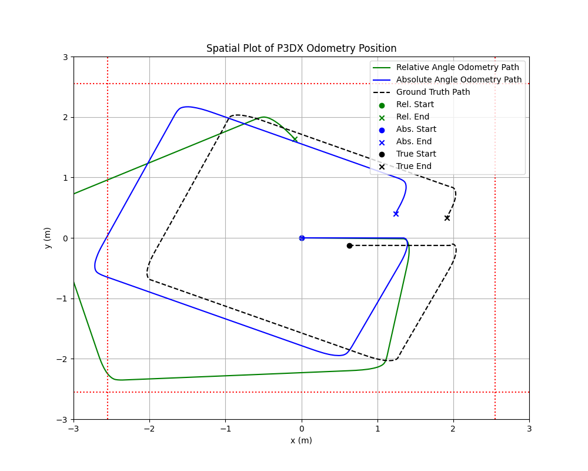
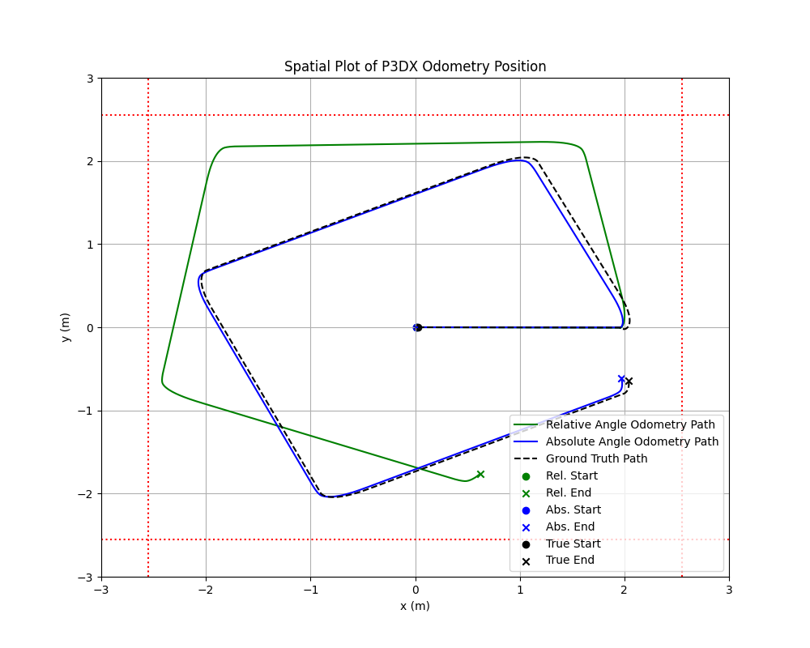
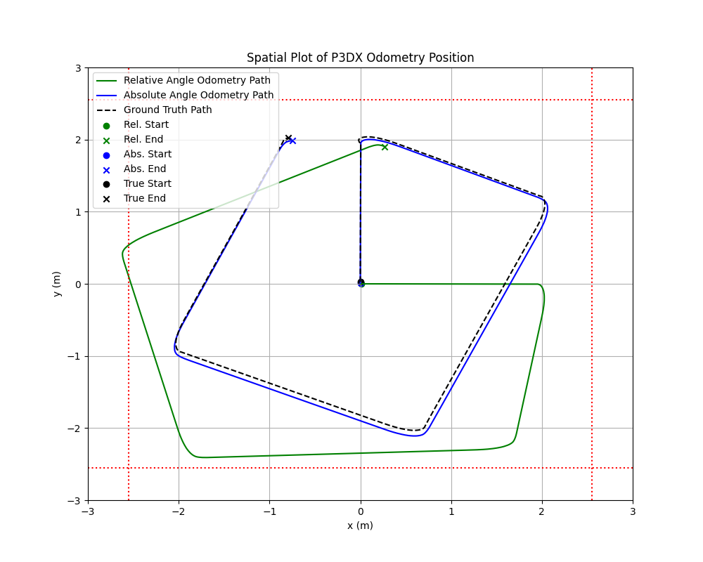

# Integral vs. Absolute Orientation Odometry Comparison

- **Date**: 1 April 2026
- **Description**: 
  - Comparison of P3DX Spatial plot:
    - Plot the $X-Y$ position of P3DX using orientation data.
    - Plot the $X-Y$ position of P3DX using angular velocity integration.

## Overview

### Plot

### Video

https://github.com/user-attachments/assets/4cdf0d33-32b7-4366-a5ac-2439b4edddb2

