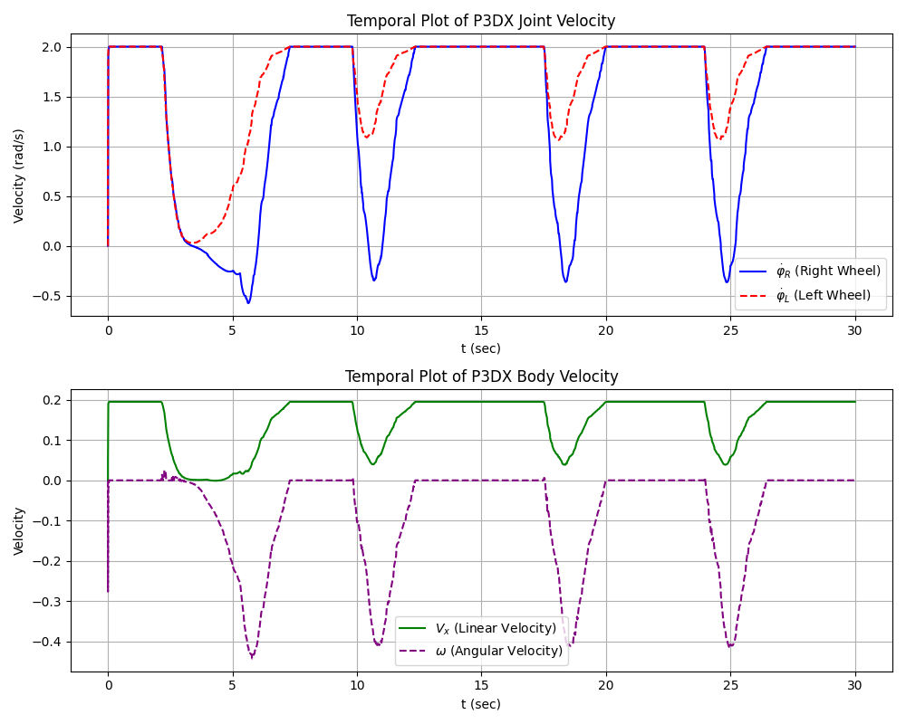

# Temporal Body Plot and Joint Velocities

- **Date**: 11 March 2026
- **Description**: 
  - Temporal plot of P3DX joint velocity:
    - $\dot{\phi_R}$ (rad/s) vs. $t$ (sec).
    - $\dot{\phi_L}$ (rad/s) vs. $t$ (sec).
  - Temporal plot of P3DX body velocity:
    - $V_x$ (m/s) vs. $t$ (sec).
    - $\omega_x$ (rad/s) vs. $t$ (sec).

## Overview

### Plot

### Video

https://github.com/user-attachments/assets/6bdf6e83-39cf-4f9d-a069-01995b3d38ce

